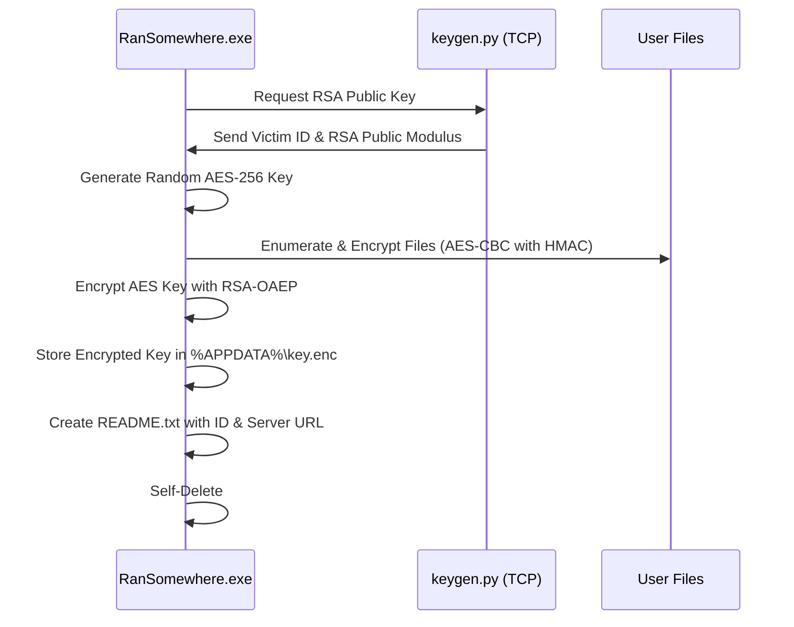
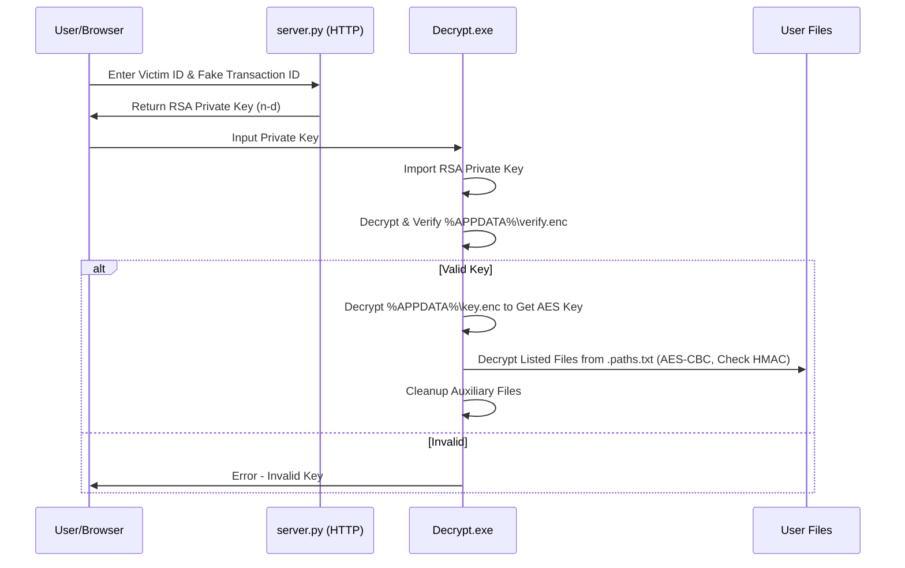

# RanSomewhere
**RanSomewhere** is a minimalist Proof of Concept (PoC) ransomware designed for educational purposes to train reverse engineering and malware analysis.
It demonstrate basic ransomware behavior by encrypting files in a specified directory.

**WARNING:** Use only in a secure, isolated lab (a Windows VM for example). Unauthorized use is prohibited, and the author is not responsible for misuse.

## Features

- Encrypts all files in the `C:\Users\` directory using the **AES-256-CBC** encryption algorithm.
- Minimalist implementation focused on showcasing essential ransomware behavior.
- Designed as a learning tool to understand the mechanics of ransomware.

## How It Works

### Overall Architecture
The system consists of a client-side encryptor/decryptor and a server-side key generator and web app. The client communicates with the server to fetch RSA public keys for encryption, and users can retrieve private keys via a web interface for decryption.


### Encryption Process
The encryptor fetches a key from the server, generates an AES key, encrypts files, and stores necessary data for later decryption.



### Decryption Process
Using the decryptor verifies that the private key from the webserver and restores files.



## Prerequisites
- A secured environment to test the client (a **Windows VM** for example)
- **Docker** installed on the host for running the server.
- **MinGW** (x86_64-w64-mingw32-gcc) on a Linux host for compiling the client


## Installation

Once you have all the prequisites, you can setup the environment with:
```
git clone git@github.com:NeKroFR/RanSomewhere.git
cd RanSomewhere
make                        # make the client
docker-compose up --build   # setup and start the server
```

## Disclaimer

This malware is intended for educational purposes only. It should not be used in any real-world attacks or unauthorized environments. The author is not responsible for any misuse of this code.
